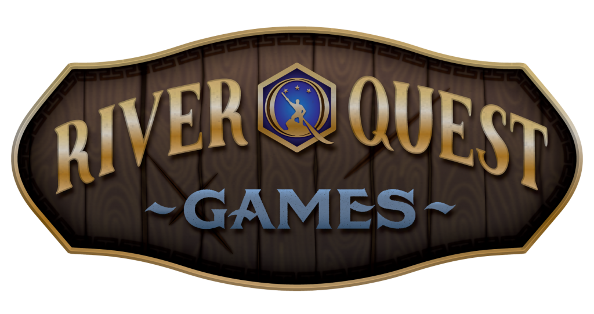

# Brao'Drana Reborn
The death of Mizzerene the Black Rose and the forging of the Iron Contract between the leaders of Kareborum led to the gods losing faith in their creations. The lasting peace of the world was shattered as the gods waged war with one another, the titans, the elemental lords, and the metallic dragon lords. Many mortal races suffered as these cosmological beings waged battle through the material plane and beyond.

The ripping of magic from the world left scars across the face of Brao’Drana and most importantly led to the creation of the four new continents: Kelios, Vahlenar, Hyboria, and Galinan A number of small islands also dot the seas of the world, each with its own unique culture, peoples, and landscapes to be discovered. Many of the races shaped by magic were lost to history, wiped from the face of Brao’Drana, potentially existing in other planes of reality.

Without magic on their side the mortal races are lost, and seek help wherever they can, with evil forces finding a foothold in lands once long forgotten…

## River Quest Games

    

RQG is a group of friends who enjoy role-playing and playing DnD (typically 5e).
We get together on a fairly regular basis to experience the world of Brao'Drana, completely written by our DM. This repository is to host the Obsidian files used to keep track of the lore of the campaign and provide easy to consume notes.

### Quartz
This site is generated using Quartz v4. Quartz is a set of tools that helps you publish your [digital garden](https://jzhao.xyz/posts/networked-thought) and notes as a website for free. Quartz v4 features a from-the-ground rewrite focusing on end-user extensibility and ease-of-use.

🔗 Read the documentation and get started: https://quartz.jzhao.xyz/

[Join the Quartz Discord Community](https://discord.gg/cRFFHYye7t)

---
#### p.s. This is my first time creating such a site, sorry it sucks.